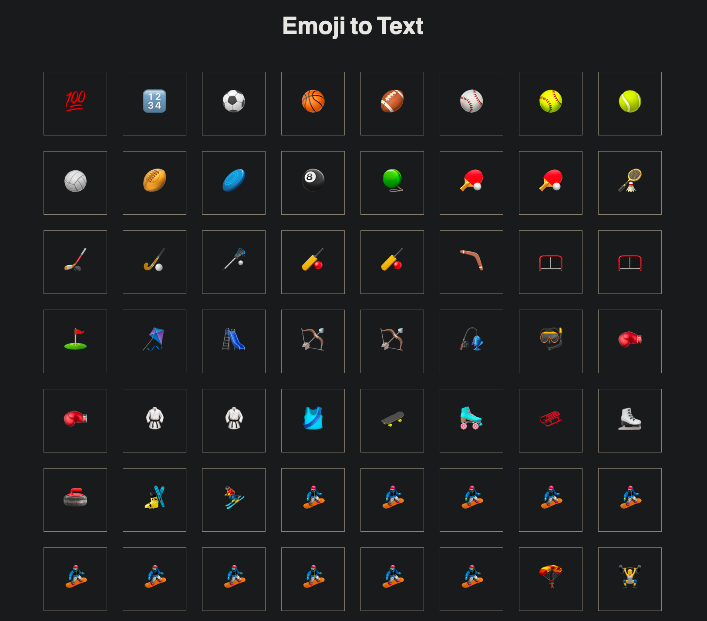

**Discord Emojis** is a simple web application that allows you to explore all the built-in emojis available on Discord and copy them to your clipboard with just one click. Whether you're looking for that perfect reaction or want to express yourself using fun and expressive emojis, this tool has got you covered!

## Features

- **Browse**: Easily scroll through a vast collection of Discord's built-in emojis.
- **Search**: Quickly find specific emojis by using the search functionality.
- **Copy and Paste**: With a single click, copy your desired emoji to your clipboard and paste it into your Discord chat effortlessly.

## How to Use

1. **Accessing the Application**: To use Discord Emojis, you can simply visit the live application hosted at [render](https://discord-emoji.onrender.com).

2. **Browsing Emojis**: Upon loading the application, you'll be presented with an array of emojis in a user-friendly interface. Scroll through the emojis or use the search bar to find a specific one.

3. **Copying Emojis**: When you find an emoji you'd like to use, click on it, and the emoji will automatically be copied to your clipboard.

4. **Pasting Emojis**: Head over to your Discord chat or any other application where you want to use the emoji and press `Ctrl + V` (Windows) or `Cmd + V` (Mac) to paste it.

## Installation and Local Setup

If you prefer to run the application locally, follow these steps:

1. **Clone the Repository**: First, clone this repository to your local machine using the following command:

```bash
git clone https://github.com/prgrmr-yn/discord-emojis.git
```
2. **Navigate to the Directory:** Enter the cloned directory:

```bash
cd discord-emojis
```
3. **Open the Application:** Launch the index.html file in your preferred web browser.

## Contributing

If you'd like to contribute to this project, you are more than welcome to! Feel free to fork this repository, make changes, and submit a pull request with your improvements. We appreciate any feedback or bug reports you may have as well!

## License

This project is licensed under the [MIT License](LICENSE), which means you are free to use, modify, and distribute the code as long as you provide appropriate attribution.

## Acknowledgments

- Discord Emojis was inspired by the vibrant Discord community and its love for emojis.
- Special thanks to the developers of [EmojiOne](https://www.emojione.com/) for their fantastic emoji artwork.

Enjoy using Discord Emojis and have a great time expressing yourself in your Discord chats! 😄🎉

Copy code
